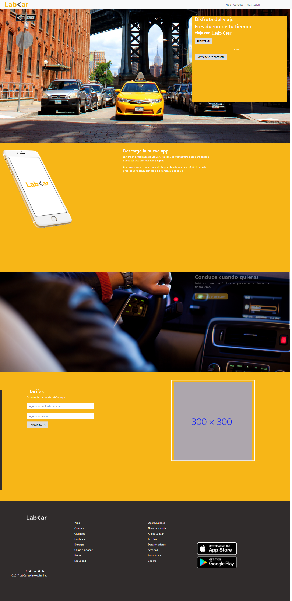

**LAB-CAR**

***DESCRIPCIÓN***

Creación de una página web donde de acuerdo a una maquetación  sugerida teniamos que recrear dos versiones de ésta:

°Versión Web
°Verión móvil

****Versión Web****

Esta versión se tiene que mostrar en dispositivos como PCs y Mac, en la cual muestra elementos que en versión móvil se ocultan.

  

****Versión Web****

En la versión móvil todo el contenido de la maquetación se tiene que adaptar al tamaño de pantalla de un dispositivo movil, celular o tablet, de cualquier sistema operativo ya sea Android o  iphone.

